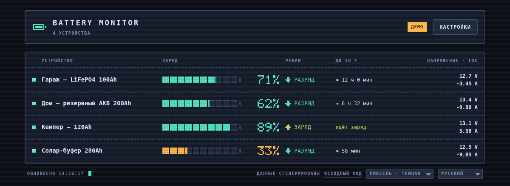
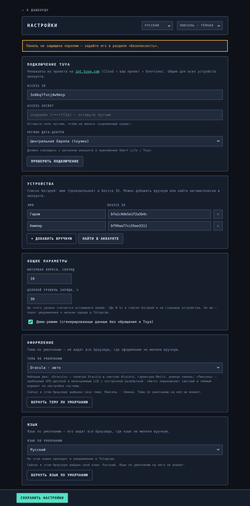

# 🔋 Battery Monitor — Tuya (DT20W)

[](LICENSE)


Веб-мониторинг литиевых батарей по данным из **Tuya Cloud API**. Несколько
устройств из одного аккаунта, наглядный дашборд, оценка времени до разряда.
Python (FastAPI) + Docker. Всё настраивается через **веб-панель администратора** —
реквизиты Tuya, поиск устройств, параметры — без правки файлов.

Заточено под *DT20W 0–420V Tuya WiFi Smart Lithium Battery Capacity Tester*
(кулоновский счётчик), но работает с любым устройством Tuya: коды точек данных
определяются автоматически из спецификации.

## Возможности

- **Список устройств** (главная): строка на батарею — имя, шкала и уровень заряда (SOC),
  режим, **оценка времени до 30 %**, напряжение и ток.
- **Детальный дашборд** по клику: SOC, напряжение, ток, мощность, температура,
  остаточная/полная ёмкость, живой график тока (заряд/разряд), таблица всех точек данных.
- **Уведомления в Telegram**: сообщение в чат, когда заряд упал ниже порога или
  когда до порога осталось меньше заданного времени (плюс «отбой» и потеря связи).
- **Админ-панель `/admin`**: ввод реквизитов Tuya, проверка подключения,
  автопоиск устройств в аккаунте, управление списком, интервал опроса, демо-режим,
  настройка уведомлений, пароль доступа.
- **Пиксельный интерфейс**: тёмная тема — приборный VFD-дисплей, светлая — монохромный
  LCD. Крупные цифры заряда рисуются растровым шрифтом 5×7 прямо в SVG, поэтому внешние
  гарнитуры не нужны и всё работает офлайн.
- Автообновление, адаптив под телефон, запуск в Docker.

| | |
|---|---|
|  |  |

---

## Быстрый старт (демо, без настройки Tuya)

```bash
DEMO_MODE=true docker compose up --build
```
Откройте <http://localhost:8000> — список из нескольких виртуальных батарей.

> Без `.env` и без реквизитов приложение само включает демо-режим.

---

## Настройка через админ-панель (рекомендуется)

1. Запустите контейнер:
   ```bash
   docker compose up --build -d
   ```
2. Откройте **<http://localhost:8000/admin>**.
3. **Задайте пароль** админ-панели (раздел «Безопасность»).
   Либо заранее через переменную `ADMIN_PASSWORD` (в `.env`).
4. В разделе **«Подключение Tuya»** введите **Access ID**, **Access Secret** и
   выберите **регион**, нажмите **«Проверить подключение»**.
5. Нажмите **«Найти в аккаунте»** — устройства подтянутся автоматически; выберите
   нужные и задайте им имена (или добавьте вручную по Device ID).
6. **Сохраните**. Дашборд на <http://localhost:8000> сразу покажет батареи.

Настройки сохраняются в файле `./data/settings.json` в папке проекта
(`/data/settings.json` внутри контейнера) и переживают рестарт.

> Контейнер работает под UID/GID **1000** — обычный UID первого пользователя Linux.
> Если `id -u` на вашем хосте выдаёт другое значение, задайте `APP_UID` и `APP_GID`
> в `.env` (см. `.env.example`), иначе контейнер не сможет писать в `./data`.

Где взять **Access ID / Secret** и **Device ID** — в разделе
[«Настройка проекта в Tuya IoT Platform»](#настройка-проекта-в-tuya-iot-platform) ниже.

---

## Настройка проекта в Tuya IoT Platform

Чтобы приложение видело батареи, нужен Cloud-проект на Tuya с сервисом **IoT Core**
и привязанным аккаунтом приложения Smart Life / Tuya Smart.

### 1. Создать проект

1. Зарегистрируйтесь на <https://iot.tuya.com>.
2. **Cloud → Development → Create Cloud Project**:
   - *Development Method* — **Smart Home** (даёт нужный набор API);
   - *Data Center* (регион) — тот же, что у аккаунта в приложении Smart Life /
     Tuya Smart. Это же значение идёт в `TUYA_API_ENDPOINT` (по умолчанию Европа).
3. Вкладка **Overview** → скопируйте **Access ID** и **Access Secret**.

### 2. Подключить нужные API

Приложению достаточно одного основного сервиса:

| API-сервис | Нужен | Зачем |
|---|:---:|---|
| **IoT Core** | ✅ обязательно | статус устройства, спецификации, инфо, список устройств |
| **Authorization** | ✅ (обычно по умолчанию) | получение access-токена |
| Device Status Notification | — | не нужен (приложение опрашивает само) |

Проверить: **Cloud → Development → проект → Service API** — в списке должен быть
**IoT Core**. Если его нет — `Go to Authorize` и добавьте.

Используемые эндпоинты (все относятся к IoT Core): `/v1.0/token`,
`/v1.0/devices/{id}/status`, `/v1.0/devices/{id}/specifications`,
`/v1.0/devices/{id}`, `/v1.0/iot-01/associated-users/devices`.

### 3. Привязать аккаунт и найти устройства

1. **Devices → Link App Account** → отсканируйте QR-код приложением Smart Life
   (без этого шага устройств в проекте не будет).
2. **Devices → All Devices** → скопируйте **Device ID** нужного устройства
   (или используйте автопоиск в панели `/admin` → «Найти в аккаунте»).

### 4. Ввести реквизиты в приложение

Access ID / Secret / регион — в панели **`/admin`** → «Проверить подключение» →
«Найти в аккаунте». Либо через `.env` (`TUYA_ACCESS_ID`, `TUYA_ACCESS_KEY`,
`TUYA_API_ENDPOINT`).

### Триал IoT Core и частые ошибки

- **IoT Core — бесплатный триал** (обычно ~1 месяц). Продление: **Cloud → Cloud
  Services → IoT Core → Extend Trial**, заполнить короткую анкету → обычно +6 месяцев
  (кнопка появляется ближе к концу срока). Когда и продлённый срок выйдет — платный
  план или новый проект (Access ID/Secret сменятся — впишите новые в `/admin`).
- Ошибка Tuya **`code 1106` / `permission deny` / `No permissions`** — почти всегда:
  не авторизован IoT Core, истёк триал, либо не привязан аккаунт (шаг 3).
- Токен получаете, но **устройств не видно** — регион `TUYA_API_ENDPOINT` не совпадает
  с регионом аккаунта.

---

## Настройка без панели (переменные окружения / файл)

Всё можно задать и без панели — на первом запуске это bootstrap-значения:

```bash
cp .env.example .env    # TUYA_ACCESS_ID / SECRET / регион, ADMIN_PASSWORD
```

Список устройств — файлом `config/devices.yml` (см. `config/devices.yml.example`):
```yaml
devices:
  - id: "bf1234567890abcdef01"
    name: "Гараж — LiFePO4 100Ah"
  - id: "bf0987654321fedcba98"
    name: "Дом — резервный АКБ 200Ah"
```
или одним устройством: `TUYA_DEVICE_ID` + `TUYA_DEVICE_NAME`.

Приоритет значений: **админ-панель (`/data/settings.json`) → переменные окружения / `config/devices.yml`**.

---

## Запуск без Docker (разработка)

```bash
python -m venv .venv && source .venv/bin/activate
pip install -r requirements.txt
DEMO_MODE=true uvicorn app.main:app --reload --port 8000
```

---

## За реверс-прокси (Caddy, nginx)

Контейнер запускается с `--proxy-headers --forwarded-allow-ips="*"`, поэтому
`X-Forwarded-Proto` учитывается и редиректы уходят на `https://`, а не на `http://`.
Минимальный `Caddyfile`:

```caddy
batt.example.com {
    reverse_proxy battery-monitor:8000
}
```

Caddy сам проставляет `X-Forwarded-Proto` и сохраняет исходный `Host`, так что
дополнительных директив не нужно.

> **Важно:** `--forwarded-allow-ips="*"` означает «доверять `X-Forwarded-*` от любого
> клиента». Это безопасно, только если до приложения нельзя достучаться в обход прокси.
> Уберите публикацию порта из `docker-compose.yml` (`ports: - "8000:8000"` → `expose: - "8000"`)
> и поместите Caddy в ту же docker-сеть. Иначе любой, кто откроет `host:8000` напрямую,
> сможет подделать эти заголовки.

---

## Уведомления в Telegram

Всё настраивается в админ-панели, раздел **«Уведомления в Telegram»** — ничего
править в файлах не нужно.

1. Создайте бота у [@BotFather](https://t.me/BotFather) → команда `/newbot` →
   скопируйте **токен** вида `123456789:AA...`.
2. Напишите боту любое сообщение (для группы — добавьте бота в неё и напишите там).
3. В админ-панели вставьте токен и нажмите **«Определить»** рядом с полем «ID чата» —
   приложение подтянет chat_id из недавних сообщений. Можно ввести и вручную:
   личный чат — положительное число, группа/канал — начинается с `-100`.
4. Отметьте, какие уведомления слать, и нажмите **«Отправить тестовое сообщение»**.
5. **Сохраните настройки.**

Что можно включить:

| Уведомление | Когда приходит |
|---|---|
| **Заряд ниже порога** | SOC ≤ «порог заряда, %» |
| **Мало времени до порога** | до порога осталось меньше N минут (оценка по току разряда) |
| **Возврат в норму** | «отбой» после того, как показатель вернулся в норму |
| **Устройство недоступно** | ошибка опроса Tuya (и сообщение при восстановлении связи) |

Параметры: **интервал проверки** (как часто сверять пороги, по умолчанию 60 с) и
**повтор напоминания** (0 — не повторять).

Антиспам: пока показатель не вернулся в норму, повторных сообщений нет (кроме
явно заданного интервала повтора). У порогов есть гистерезис (2 % для заряда,
+25 % для времени), поэтому у самой границы уведомления не «дребезжат».
Последние отправленные сообщения и ошибки видны в журнале там же, в админ-панели.

> Проверки идут в фоновом потоке приложения; после перезапуска контейнера
> состояние порогов начинается с чистого листа, поэтому активная тревога может
> прийти повторно.

---

## Как считается «время до 30%»

Кулоновский метод: `(остаточная_Ah − 0.30 × полная_Ah) / ток_разряда`.
Ток берётся по знаку (отрицательный = разряд); если тока нет — оценивается как
мощность ÷ напряжение. Если устройство заряжается, простаивает или не отдаёт
ёмкость — вместо времени показывается соответствующий статус.

---

## API

| Метод | Назначение |
|-------|------------|
| `GET /` | Список устройств |
| `GET /device/{id}` | Детальный дашборд устройства |
| `GET /admin` | Панель администратора |
| `GET /api/devices` | Сводка по всем устройствам (SOC, режим, ETA) |
| `GET /api/status?device_id=` | Полное состояние одного устройства |
| `GET /api/raw?device_id=` | Сырой статус + спецификация (отладка кодов DP) |
| `GET /api/config` | Настройки для фронтенда |
| `POST /api/admin/login` · `GET/POST /api/admin/settings` · `POST /api/admin/test-connection` · `GET /api/admin/discover` · `POST /api/admin/password` | Админ-API (защищены токеном при заданном пароле) |
| `POST /api/admin/telegram/test` · `POST /api/admin/telegram/chats` · `GET /api/admin/telegram/log` | Уведомления: тест, поиск chat_id, журнал |
| `GET /healthz` | Проверка работоспособности |

---

## Безопасность

- Пароль админ-панели хранится хэшем (PBKDF2), доступ — по подписанному токену
  (HMAC). Дашборд и публичное API открыты (данные о батареях, не секреты).
- **Access Secret, токен бота и настройки хранятся в `./data/settings.json` в открытом
  виде** —
  это нормально для self-hosted, но держите каталог `./data` приватным и не коммитьте
  его содержимое (уже в `.gitignore`). Для доступа извне LAN используйте reverse-proxy с TLS.

---

## Структура проекта

```
battery-monitor/
├── app/
│   ├── main.py            # FastAPI: страницы, публичное и админ API
│   ├── store.py           # постоянные настройки + рантайм-состояние
│   ├── config.py          # bootstrap из окружения
│   ├── auth.py            # хэш пароля + токены
│   ├── tuya_client.py     # клиент Tuya Cloud (подпись, токен, поиск устройств)
│   ├── devices.py         # загрузка списка устройств
│   ├── metrics.py         # нормализация DP + оценка времени до 30%
│   ├── notifier.py        # Telegram: фоновая проверка порогов + отправка
│   ├── demo.py            # демо-данные
│   └── static/            # index.html · device.html · admin.html
│                          # pixel.css · pixel.js — общая пиксельная тема
├── config/devices.yml.example
├── Dockerfile · docker-compose.yml · requirements.txt · .env.example
```

---

## Лицензия

[MIT](LICENSE) © 2026 scatari69
